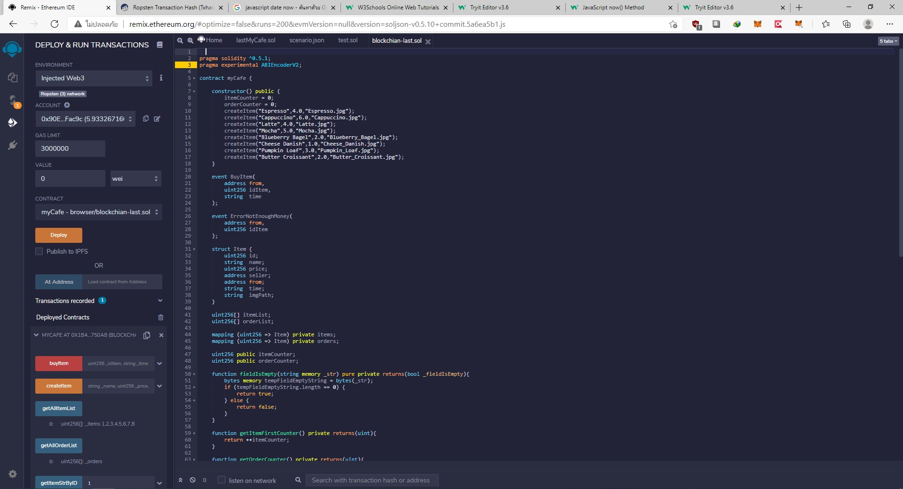
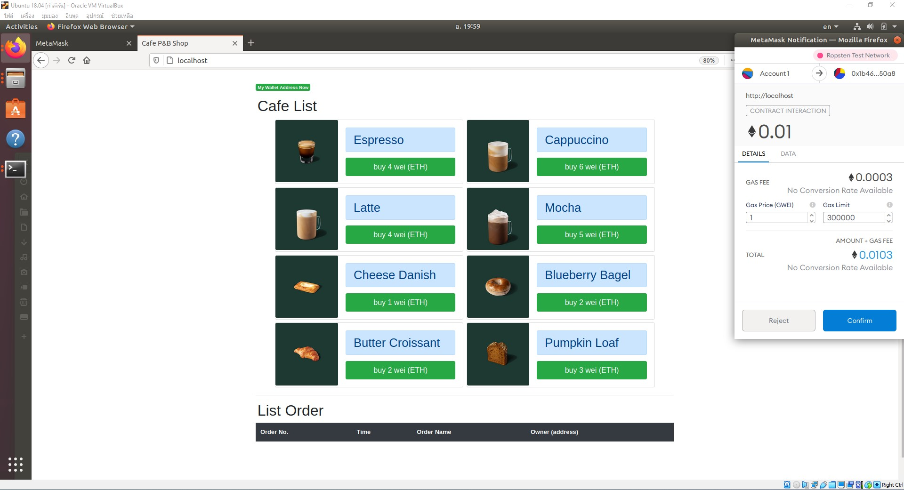
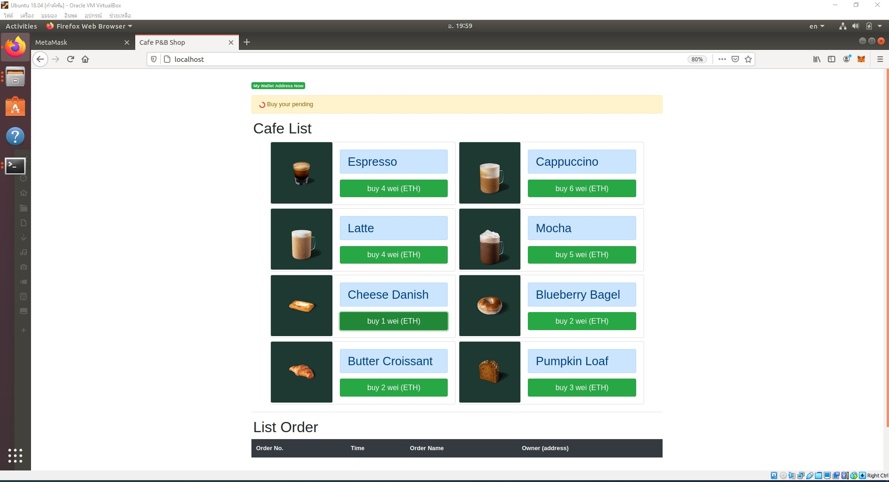
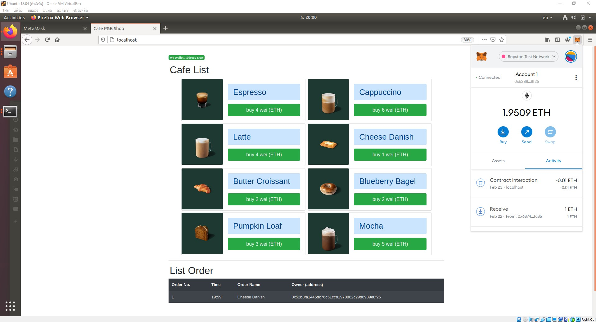
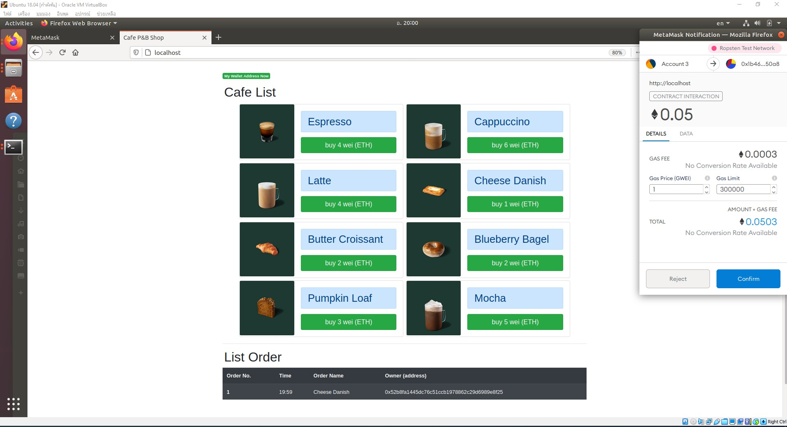
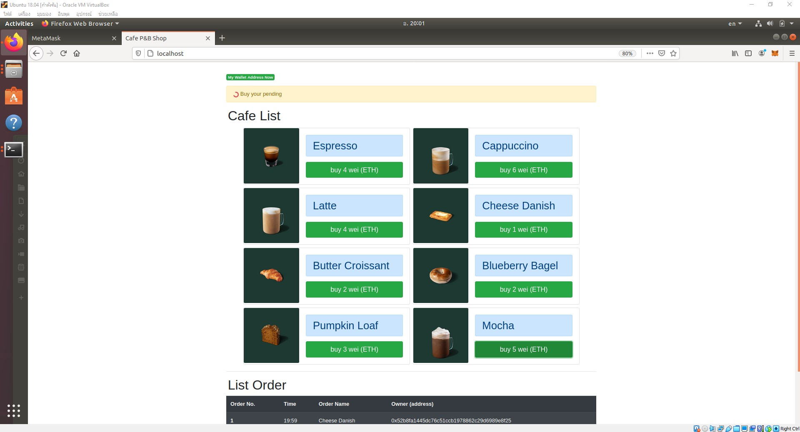
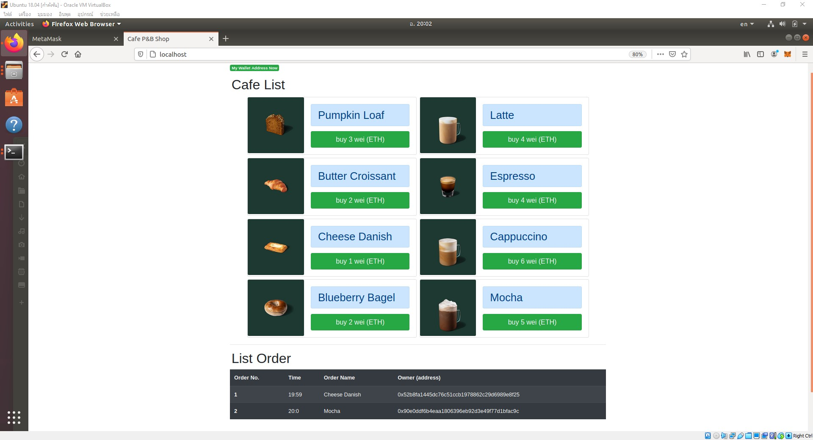
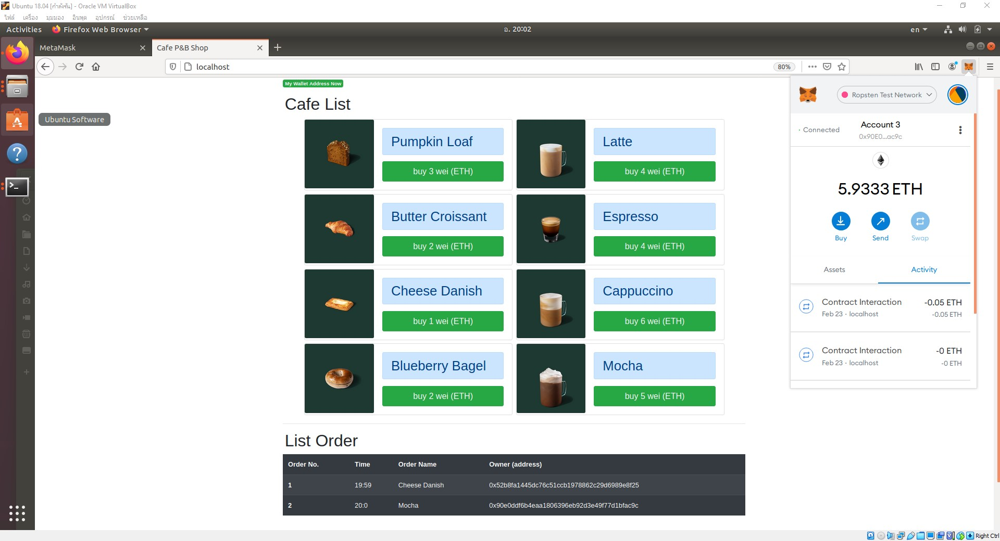

# Smart-Contract-WebCafe
Web Cafe using Smart Contract on Ethereum Ropsten Test network.

# Team members

    1. Mr. Thanat Sukantatoon (นายธเนศ สุคันธตูล) B6115821
    2. Mr. Doonyawat Inla (นายดุลยวัต อินหล้า) B6117566

## Requirement

    1. [Ubuntu 18.04.5] download from here https://releases.ubuntu.com/18.04/
    2. [Nodejs] how to install from here https://www.digitalocean.com/community/tutorials/how-to-install-node-js-on-ubuntu-18-04
    3. [remixIDE http://remix.ethereum.org/] to publish contract.
    4. [MetaMask - Microsoft Edge Extension] to be virtual Wallet.
    5. [MetaMask Legacy Web3 - Microsoft Edge Extension] API to websites you visit so they can interact with the Smart Contract.
    6. [Web3.js 0.20.7] is a collection of libraries that allow you to interact with a local or remote ethereum node using HTTP, IPC or WebSocket.

 ### Deployed Smart Contract on Ethereum Ropsten Test network.
 1. go to path Solidity/myCafe.sol
 2. upload to http://remix.ethereum.org/
 3. DEPLOY with Injected Web3 with your MetaMask account (used Ropsten Test Network).
 4. Copy your Deployed Contracts Address to file path -> public/config.js

 ### Start Web Server
 1. `git clone https://github.com/B6117566/Smart-Contract-WebCafe.git`
 2. `cd Smart-Contract-WebCafe`
 3. `sudo npm install`
 4. `sudo npm start`
 5. Open Web Browser on Url Address -> http://localhost:80/ or http://localhost/

## Picture
##
</img>

##
</img>

##
</img>

##
</img>

##
</img>

##
</img>

##
</img>

##
</img>

